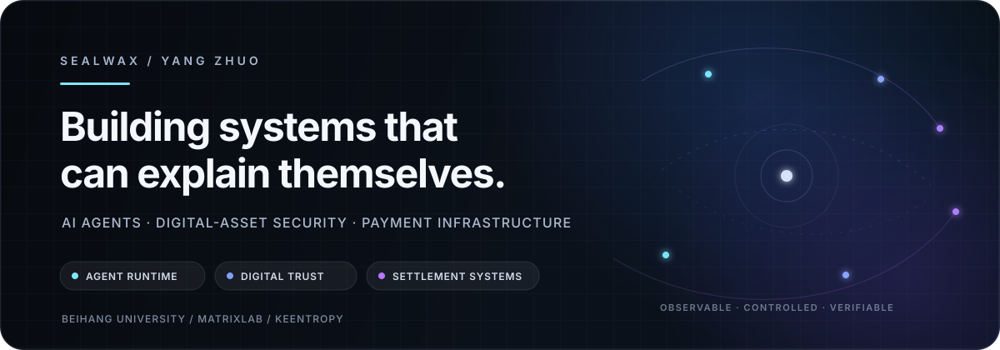

  

  
  
  
  

  <strong>Software Engineering undergraduate at Beihang University · Researcher at MatrixLab · Builder at KeEntropy</strong> 
  I design local-first agent runtimes, digital-asset security systems, and standards-driven payment infrastructure.

---

## System map

<table>
  <tr>
    <td width="33%" valign="top">
      <h3>01 · Agent systems</h3>
      
Observable, controllable runtimes that connect models with workspaces, tools, MCP servers, memory, approvals, and durable execution history.

      
<code>runtime</code> <code>tool safety</code> <code>local-first</code> <code>MCP</code>

    </td>
    <td width="33%" valign="top">
      <h3>02 · Digital trust</h3>
      
Pre-execution risk gating, cross-chain fund graphs, KYT/KYA research, wallet security, and explainable evidence for digital-asset investigations.

      
<code>risk oracle</code> <code>graph intelligence</code> <code>Web3 security</code>

    </td>
    <td width="33%" valign="top">
      <h3>03 · Payment infrastructure</h3>
      
Standards conformance and settlement research across ISO 20022, CBPR+, CIPS, e-CNY, multi-CBDC, RTGS/DNS, and atomic PvP workflows.

      
<code>ISO 20022</code> <code>e-CNY</code> <code>ledger invariants</code>

    </td>
  </tr>
</table>

## Flagship systems

<table>
  <tr>
    <td width="50%" valign="top">
      <h3><a href="https://github.com/24373054/TLAH-Studio">TLAH Studio</a></h3>
      
<strong>A native Windows workspace for observable, controllable AI agents.</strong>

      
Brings chat, multi-step tool execution, workspace review, MCP, provider debugging, artifacts, checkpoints, permissions, and durable run history into one local-first desktop product.

      

        
        
        
      

      
<code>.NET 8</code> <code>WinUI 3</code> <code>SQLite</code> <code>MCP</code> <code>ECDSA updates</code>

    </td>
    <td width="50%" valign="top">
      <h3><a href="https://github.com/24373054/00SWIFT">00SWIFT</a></h3>
      
<strong>A standards-driven SWIFT, CIPS, e-CNY, and multi-CBDC payment research platform.</strong>

      
Explores authenticated payment APIs, versioned ISO 20022 profiles, durable payment lifecycles, double-entry digital-currency ledgers, RTGS/DNS settlement, and atomic cross-border PvP.

      

        
        
        
      

      
<code>Python</code> <code>FastAPI</code> <code>PostgreSQL</code> <code>ISO 20022</code> <code>CBDC</code>

    </td>
  </tr>
</table>

## Selected project atlas

| System | Domain | What it explores | Stage |
|---|---|---|---|
| **[ChainTrace](https://github.com/24373054/ChainTrace) / [REALTrace](https://github.com/24373054/REALTrace)** | Digital-asset intelligence | Multi-chain transaction tracing, fund-flow graphs, entity/risk visualization, and AI-assisted investigation interfaces | Research prototype |
| **[MatrixLabs Wallet](https://github.com/24373054/MatrixLabsWallet)** | Wallet security | EVM browser wallet with local key protection, multi-chain operations, DeFi surfaces, and transaction-risk UX | Product prototype |
| **[瀛州纪 · Immortal Ledger](https://github.com/24373054/Web3-games)** | Web3 × AI | A fully on-chain narrative world with digital-being NFTs, an immutable world ledger, and state-aware AI NPCs | Experimental game |
| **[GitSentinel Mailer](https://github.com/24373054/GitSentinel-Mailer)** | Developer tooling | Repository-change monitoring with configurable polling, persistent project state, and themed email notifications | Open-source tool |
| **[LLM Chat Server](https://github.com/24373054/llm-server)** | AI infrastructure | Local Qwen inference through vLLM, streaming chat APIs, GPU deployment, and lightweight multi-user access | Infrastructure prototype |
| **[Matrix Lab Web](https://github.com/24373054/matrixlab)** | Research communication | Research, publication, laboratory, and technology-transfer web presence | Production website |

## Current research and product questions

- How should an agent expose **intent, actions, permissions, uncertainty, and replayable evidence** instead of hiding execution behind a chat interface?
- Can digital-asset risk move from post-event reporting to **pre-execution gating** without turning probabilistic evidence into false certainty?
- How can heterogeneous payment systems preserve **message semantics, ledger invariants, operational recoverability, and regulatory boundaries** across institutions?
- What belongs on-chain, what belongs locally, and what must remain behind an explicit human or institutional trust boundary?

## Engineering profile

**Languages** · `C#` `Python` `TypeScript` `JavaScript` `Solidity` `SQL` `C/C++`  
**Application systems** · `.NET 8` `WinUI 3` `React` `Next.js` `FastAPI` `Node.js`  
**Data & infrastructure** · `SQLite` `PostgreSQL` `Redis` `Docker` `GitHub Actions` `Nginx` `vLLM`  
**Web3 & payments** · `Ethereum / EVM` `ethers.js` `Hardhat` `ISO 20022` `RTGS / DNS` `double-entry ledgers`  
**Agent engineering** · `tool orchestration` `MCP` `workspace isolation` `approval systems` `memory` `observability`

## How I build

<table>
  <tr>
    <td width="25%" align="center"><strong>Local-first</strong> Keep data and control close to the user whenever the system permits it.</td>
    <td width="25%" align="center"><strong>Observable</strong> Execution should leave a readable trail of decisions, tools, artifacts, and failures.</td>
    <td width="25%" align="center"><strong>Boundary-aware</strong> Security claims must state exactly what is protected, bypassed, trusted, or simulated.</td>
    <td width="25%" align="center"><strong>Reproducible</strong> Standards, tests, migrations, release artifacts, and research assumptions should be auditable.</td>
  </tr>
</table>

<strong>中文简介</strong>

 

我是杨卓（SealWax），北京航空航天大学软件工程专业本科生，MatrixLab 研究成员，也是刻熵科技的产品与技术构建者。

目前主要围绕三条主线开展工作：

1. **可观察、可控的智能体系统**：研究模型、工具、工作区、权限、记忆与长期任务如何组成真正可用的 Agent Runtime；
2. **数字资产安全与链上分析**：关注执行前风险门控、跨链资金图谱、KYT/KYA、钱包安全与可解释证据；
3. **跨境支付与数字货币基础设施**：研究 ISO 20022、CIPS、数字人民币、多 CBDC、清算结算及账本不变量。

我更在意系统是否能清楚说明：**它做了什么、为什么这样做、依据是什么，以及信任边界在哪里。**

---

  Build agents that expose their actions, ledgers that preserve invariants, and security systems that make risk visible before execution.

