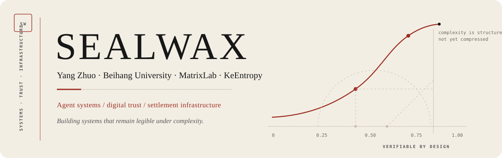
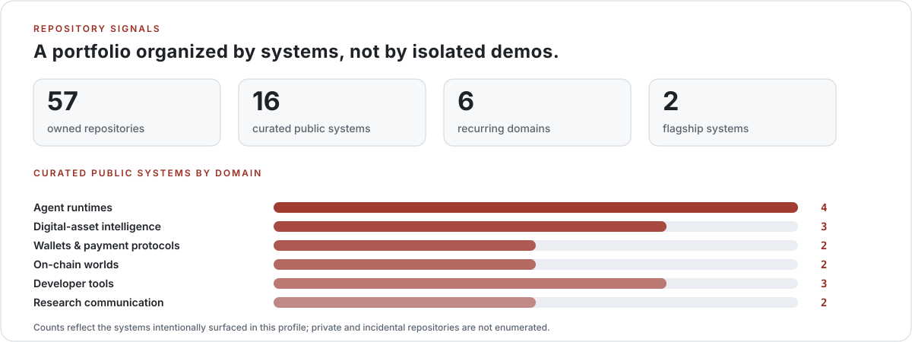
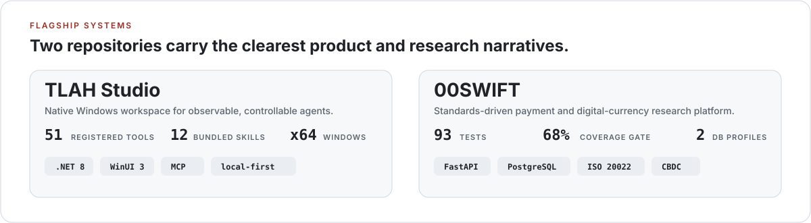

  <picture>
    <source media="(prefers-color-scheme: dark)" srcset="./assets/profile/hero-dark.svg">
    
  </picture>

  
  
  
  

  I build systems where models, tools, ledgers, and trust boundaries meet.

---

## Current work

<table>
  <tr>
    <td width="33%" valign="top">
      <strong>Agent systems</strong>  
      Native runtimes, tool orchestration, workspaces, approvals, MCP, memory, debugging, and durable execution records.
    </td>
    <td width="33%" valign="top">
      <strong>Digital trust</strong>  
      Pre-execution risk gating, cross-chain fund graphs, wallet security, KYT/KYA research, and explainable investigation interfaces.
    </td>
    <td width="33%" valign="top">
      <strong>Settlement infrastructure</strong>  
      ISO 20022, CIPS, e-CNY, multi-CBDC, payment lifecycles, ledger invariants, RTGS/DNS, and atomic PvP research.
    </td>
  </tr>
</table>

## Selected systems

<table>
  <tr>
    <td width="50%" valign="top">
      <h3><a href="https://github.com/24373054/TLAH-Studio">TLAH Studio</a></h3>
      
<strong>Native Windows workspace for observable, controllable AI agents.</strong>

      
Chat, multi-step tools, workspace review, MCP, artifacts, checkpoints, permissions, provider diagnostics, and local run history in one desktop product.

      

        
        
        
      

      
<code>.NET 8</code> <code>WinUI 3</code> <code>SQLite</code> <code>MCP</code> <code>signed updates</code>

    </td>
    <td width="50%" valign="top">
      <h3><a href="https://github.com/24373054/00SWIFT">00SWIFT</a></h3>
      
<strong>Standards-driven payment and digital-currency research platform.</strong>

      
Versioned ISO 20022 profiles, authenticated payment APIs, durable lifecycles, CIPS research, double-entry e-CNY ledgers, RTGS/DNS, and multi-CBDC settlement.

      

        
        
        
      

      
<code>Python</code> <code>FastAPI</code> <code>PostgreSQL</code> <code>ISO 20022</code> <code>CBDC</code>

    </td>
  </tr>
</table>

## Repository signals

  <picture>
    <source media="(prefers-color-scheme: dark)" srcset="./assets/profile/portfolio-dark.svg">
    
  </picture>

  <picture>
    <source media="(prefers-color-scheme: dark)" srcset="./assets/profile/flagships-dark.svg">
    
  </picture>

  <a href="https://github.com/24373054/TLAH-Studio"><strong>Open TLAH Studio</strong></a>
  &nbsp;·&nbsp;
  <a href="https://github.com/24373054/00SWIFT"><strong>Open 00SWIFT</strong></a>

## Repository map

| Direction | Public systems | Role |
|---|---|---|
| **Agent runtimes** | [TLAH Studio](https://github.com/24373054/TLAH-Studio), [TLAH](https://github.com/24373054/TLAH), [Matrix-Agent](https://github.com/24373054/Matrix-Agent), [llm-server](https://github.com/24373054/llm-server) | Desktop agents, prompt/runtime research, tool orchestration, and local model serving |
| **Digital-asset intelligence** | [ChainTrace](https://github.com/24373054/ChainTrace), [REALTrace](https://github.com/24373054/REALTrace), [StableGuard](https://github.com/24373054/StableGuard) | Fund-flow graphs, investigation surfaces, risk evidence, and agent-assisted security |
| **Wallets and protocols** | [MatrixLabsWallet](https://github.com/24373054/MatrixLabsWallet), [00SWIFT](https://github.com/24373054/00SWIFT) | User-side transaction security and standards-driven payment infrastructure |
| **On-chain worlds** | [瀛州纪 · Immortal Ledger](https://github.com/24373054/Web3-games), [OpenImmortal](https://github.com/24373054/OpenImmortal) | Smart-contract worlds, digital beings, and AI-mediated narrative systems |
| **Developer tools** | [GitSentinel-Mailer](https://github.com/24373054/GitSentinel-Mailer), [SecureChat](https://github.com/24373054/SecureChat), [QRCodeGenerator](https://github.com/24373054/QRCodeGenerator) | Monitoring, encrypted communication, and focused utility software |
| **Research communication** | [Matrix Lab Web](https://github.com/24373054/matrixlab), [Portfolio](https://github.com/24373054/24373054.github.io) | Research, publications, project narratives, and public documentation |

## Questions I keep returning to

- How can an agent expose intent, actions, permissions, uncertainty, and replayable evidence without becoming unusably complex?
- Can digital-asset security move from post-event reporting to pre-execution gating without presenting probabilistic evidence as certainty?
- How should heterogeneous payment systems preserve message semantics, ledger invariants, failure recovery, and institutional boundaries?
- What belongs on-chain, what belongs locally, and what must remain explicitly human-governed?

## Working vocabulary

`C#` · `Python` · `TypeScript` · `Solidity` · `.NET 8` · `WinUI 3` · `React` · `FastAPI` · `PostgreSQL` · `SQLite` · `Docker` · `GitHub Actions` · `vLLM` · `Ethereum / EVM` · `ISO 20022` · `MCP` · `tool safety` · `graph intelligence` · `double-entry ledgers`

<strong>中文简介</strong>

 

我是杨卓（SealWax），北京航空航天大学软件工程专业本科生，MatrixLab 研究成员，也是刻熵科技的产品与技术构建者。

目前主要围绕三条主线开展工作：

1. **可观察、可控的智能体系统**：研究模型、工具、工作区、权限、记忆与长期任务如何组成真正可用的 Agent Runtime；
2. **数字资产安全与链上分析**：关注执行前风险门控、跨链资金图谱、KYT/KYA、钱包安全与可解释证据；
3. **跨境支付与数字货币基础设施**：研究 ISO 20022、CIPS、数字人民币、多 CBDC、清算结算及账本不变量。

我更在意一个系统能否清楚说明：**它做了什么、为什么这样做、依据是什么，以及信任边界在哪里。**

---

  Systems by design · Trust by construction · Verifiable where it matters

